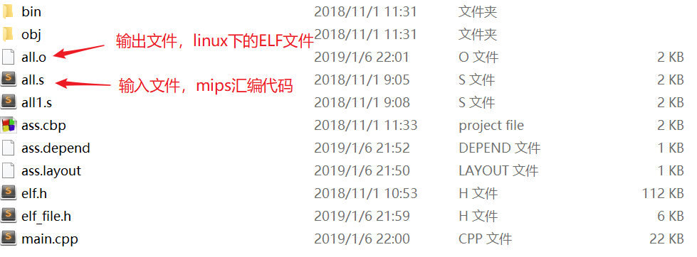
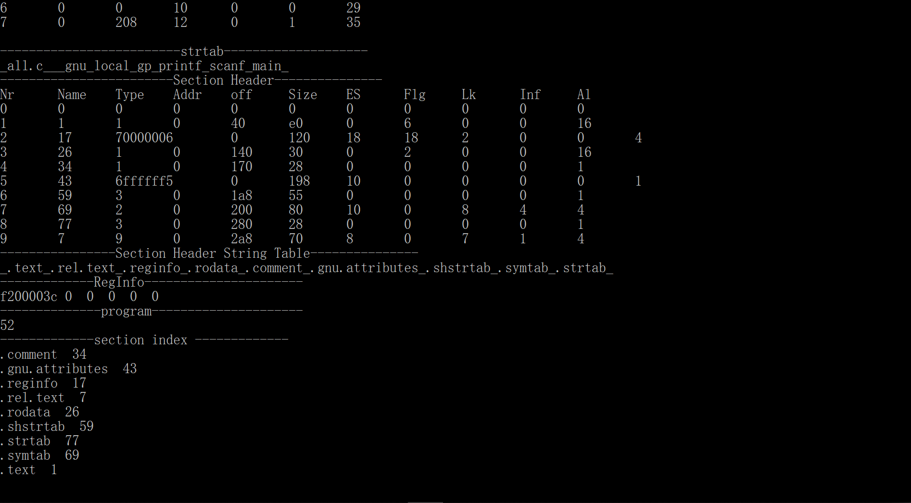

基于龙芯平台的MIPS汇编器
==========

- [简介](#简介)
- [作者](#作者)
- [环境](#环境)
- [操作指南](#操作指南)
- [运行结果](#运行结果)
- [参考文献](#参考文献)
- [配套软件](#配套软件)

## 简介

该项目是《基于龙芯处理器的C语言编译系统的设计与实现》（包括PC和龙芯平台的通信、编译器、汇编器和链接器的编写）的子项目，主要工作为将MIPS汇编代码翻译为Linux下可执行的ELF文件。

本部分的输入文件是通过C语言编译器生成的对应汇编代码，不仅包括汇编指令还有相关汇编器指令，格式可参考gcc编译器翻译得到的汇编文件格式。

本部分得到的运行结果（未重定位的ELF文件）可以在龙芯平台上经过mipsel-linux-gcc交叉编译器链接得到最终的可执行ELF文件，运行得到结果。

## 作者

[王楚涵](https://www.wchhlbt.cn/)、[王子泰](http://wang22ti.com/)

## 环境

OS ： Windows / Linux

Compiler : gcc

IDE : Code::blocks (推荐，也可使用其他IDE)

## 操作指南

需要将待翻译的汇编代码放在工程目录下，具体路径可在代码中更改，编译运行即可。

main.cpp : 主要功能代码 将汇编代码翻译并写入ELF文件

elf.h : linux系统提供的相关ELF文件库 定义了ELF文件的基本格式和数据结构

​	    windows系统下运行需要将该文件放入工程中

elf_file.h :  我们定义的ELF_File类 便于写ELF文件

## 运行结果

对汇编器指令（并非汇编代码，而是对汇编器的一些设置）的翻译：

对汇编指令的翻译，第一列的数字表示相对代码段初始地址的偏移量：

对ELF文件中段表的翻译的结果，在linux下用readelf命令可以得到相似结果：

## 参考文献

相比我们比较优雅的代码，这些参考文献还是更有价值的：

1. 《自己动手构造编译系统++编译、汇编与链接》。关于x86和Linux环境下的MIPS编译器，中文且非常详细，对我们的工作有启发价值。此外，该书的配套代码已经在[GitHub](https://github.com/fanzhidongyzby/cit/tree/x86)上开源了，十分良心了。
2. ·《See MIPS Run》。中英文都有，对于MIPS指令及其编码、函数调用等方面讲解非常详细，和我们工作最相关的是第2、8、9、11、16章。
3. 《ELF_Format》。中英文都有，对于ELF文件各个段的讲解十分详细，对于文献1是一种有益的补充。

## 配套软件

要理解汇编到ELF的翻译工作，离不开对于ELF文件的直接阅读，自然不能少了很多工具：

1. readelf，Linux自带的读取ELF头信息的命令
2. BinaryViewer，可以轻松以各种方式查看二进制文件
3. IDA_PRO，以更高级的方式阅读ELF文件，比如指出某段数据是哪一个段的，不过阅读方式不如BinaryViewer灵活多样。
4. Snipaste，一个优秀的截图贴图软件，可以方便的依靠贴图在各个文件之间比对。。
5. pyelftools，python阅读elf文件的包